# 🍊 Fruit Slice Detector
### 🤖 AI-Powered Fruit Classification Mobile App

**Instantly identify fruit slices using Machine Learning**  
*A Computer Science Final Project*

---

## 📱 About This Project

**Fruit Slice Detector** is a Flutter mobile app that classifies fruit slices in real-time using **TensorFlow Lite**. Users can scan fruits via camera or gallery, and the app identifies **10 different fruit types** with high accuracy. This project demonstrates practical use of **AI, computer vision, and mobile development** with a modern UI/UX design.

---

## ✨ Key Features

- 🎯 Real-Time Classification using camera or gallery
- 🧠 AI-Powered on-device TensorFlow Lite model
- 📊 Confidence Scoring for predictions
- 📈 Analytics Dashboard with pie and line charts
- 🗂️ Scan History with thumbnails and timestamps
- ☁️ Firebase Firestore integration for cloud storage
- 🎨 Modern gradient UI with smooth animations
- 📱 Cross-Platform (Android & iOS)
- 🚀 Optimized for fast performance
- 🔒 Privacy-Focused: All ML processing on-device

---

## 🍎 Detectable Fruit Classes

### 1. 🍊 Orange Slice

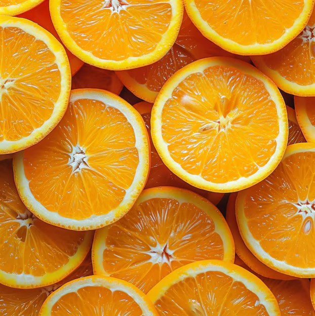

**Description:** The orange is a classic citrus fruit, known worldwide for its vibrant color and refreshing taste. When sliced, oranges reveal a beautiful internal structure.  

---

### 2. 🍋 Lemon Slice

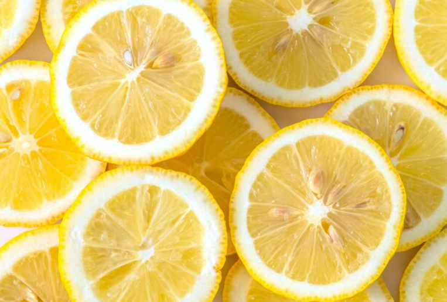

**Description:** Lemons are tart citrus fruits with a pale yellow color. Lemon slices are lighter, more translucent, and smaller than oranges.  

---

### 3. 🍈 Grapefruit Slice

**Description:** Grapefruit is a large citrus fruit with pink to red flesh, known for its bitter-sweet taste and beautiful coloring.  

---

### 4. 🍎 Apple Slice

**Description:** Apples reveal a distinctive star-shaped seed pattern when sliced horizontally, making them instantly recognizable.  

---

### 5. 🍉 Watermelon Slice

**Description:** Watermelon has bright red flesh, black seeds, and a green rind, making it visually distinctive.  

---

### 6. 🍓 Strawberry Slice

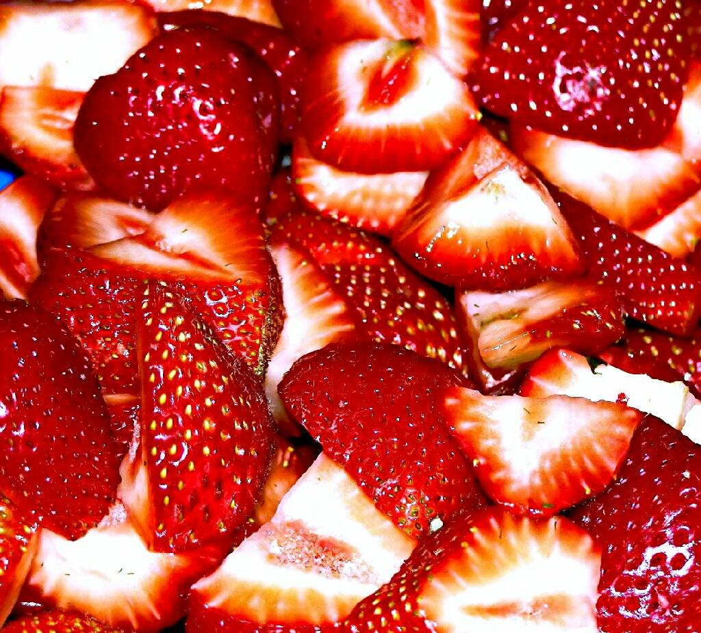

**Description:** Strawberries are small, sweet berries with tiny seeds on the exterior. When sliced, they show a lighter interior flesh.  

---

### 7. 🥝 Kiwi Slice

**Description:** Kiwi has bright green flesh, a white center, and tiny black seeds in a radial pattern, making it visually striking.  

---

### 8. 🍍 Pineapple Slice

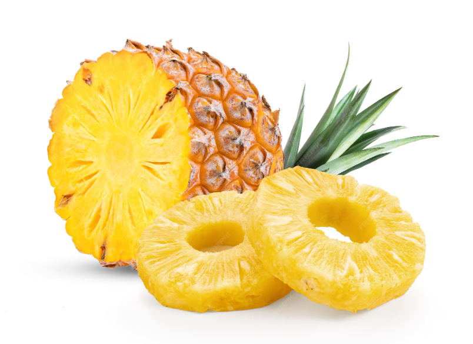

**Description:** Pineapple has golden flesh and a fibrous texture with a distinct circular core, making slices easy to identify.  

---

### 9. 🍌 Banana Slice

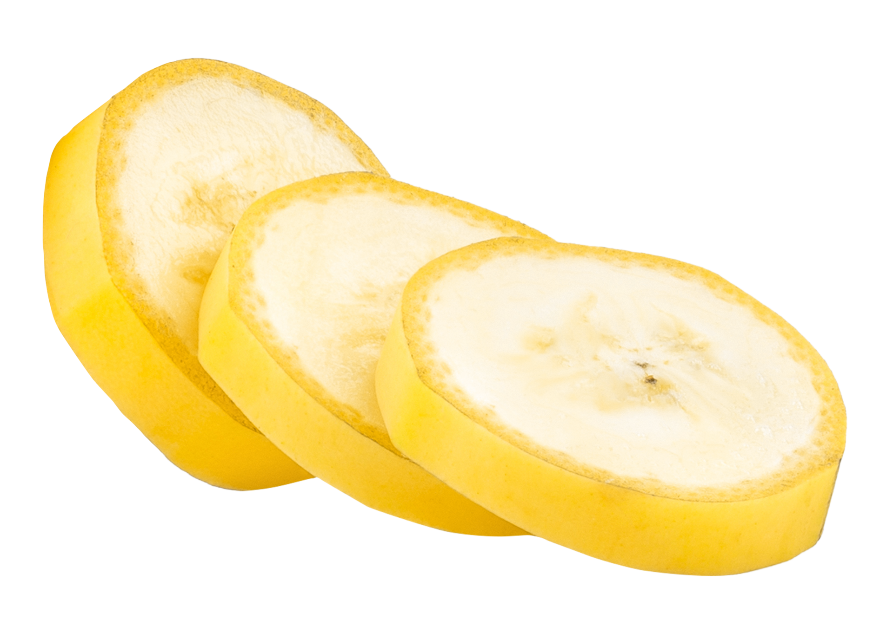

**Description:** Bananas create perfect circular "coins" with a creamy texture when sliced. They have no seeds or complex internal structure.  

---

### 10. 🥭 Mango Slice

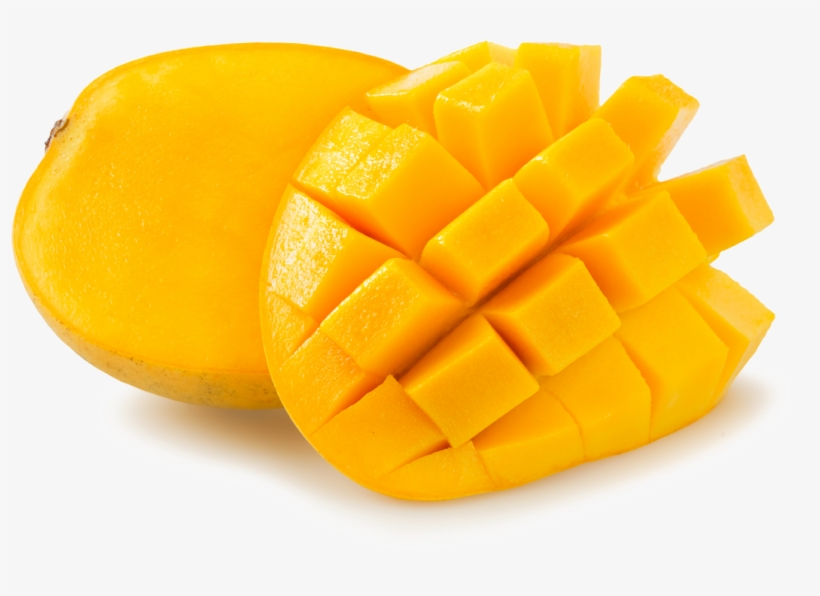

**Description:** Mango is known as the "king of fruits" with golden-orange flesh and smooth, fibrous texture.  

---

## 📸 App Screenshots

### Splash Screen & Home Interface

<table>
<tr>
<td align="center" width="33%">
 
<b>🎨 Splash Screen</b> 
Animated welcome screen with gradient background
</td>
<td align="center" width="33%">
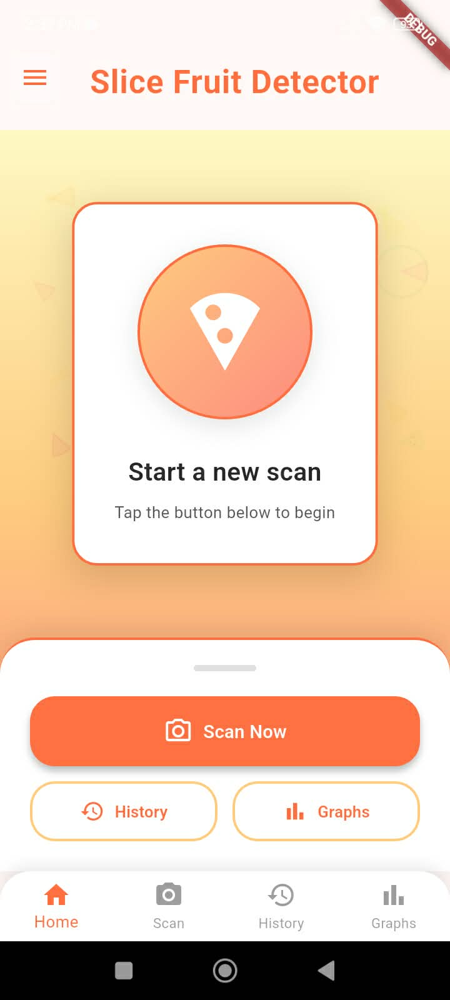 
<b>🏠 Home Page</b> 
Main dashboard with quick action buttons
</td>
<td align="center" width="33%">
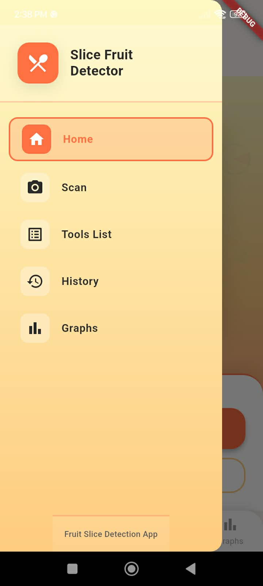 
<b>📋 Navigation Drawer</b> 
Side menu for accessing all app features
</td>
</tr>
</table>

---

### Scanner & Detection Interface

<table>
<tr>
<td align="center" width="33%">
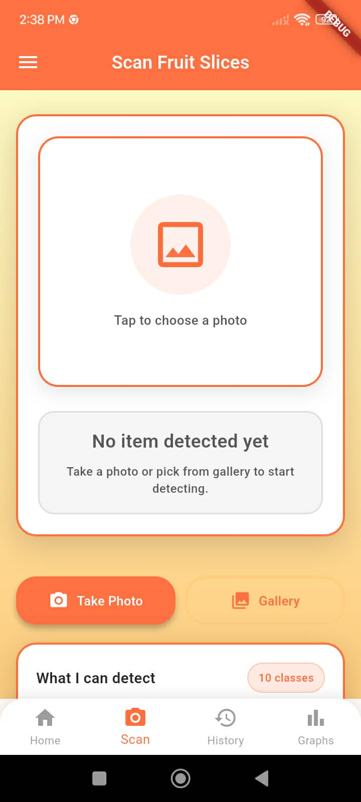 
<b>📷 Scanner Ready</b> 
Interface ready to capture or select fruit image
</td>
<td align="center" width="33%">
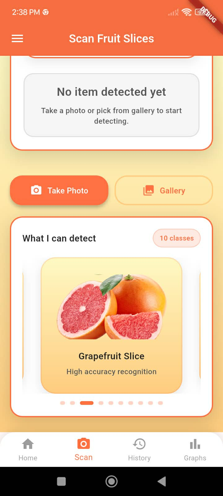 
<b>🎠 Class Carousel</b> 
Browse all detectable fruit classes
</td>
<td align="center" width="33%">
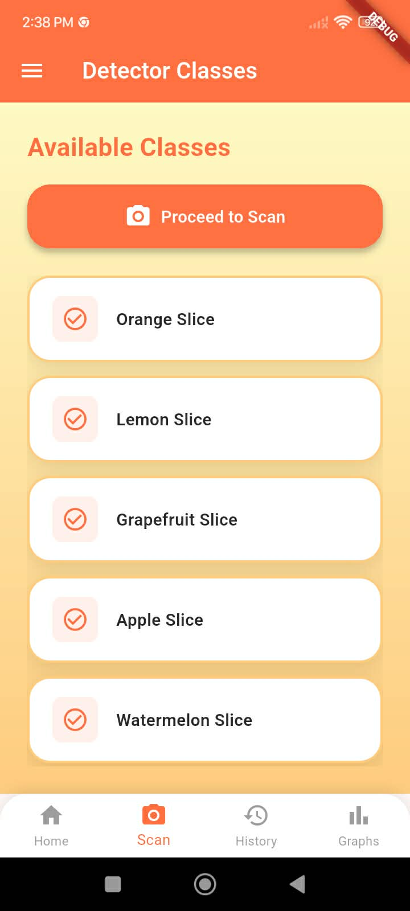 
<b>📝 Available Classes</b> 
List of all detectable fruit slices
</td>
</tr>
</table>

---

### Detection Results & Prediction Distribution

<table>
<tr>
<td align="center" width="33%">
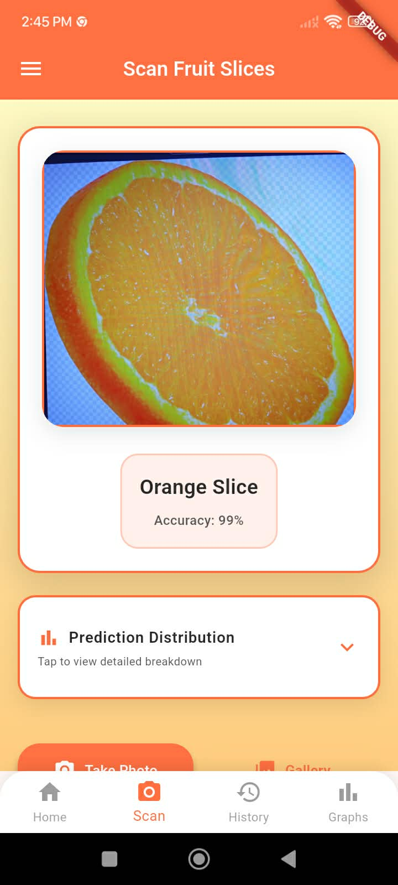 
<b>🍊 Orange Detected</b> 
Successful classification with confidence
</td>
<td align="center" width="33%">
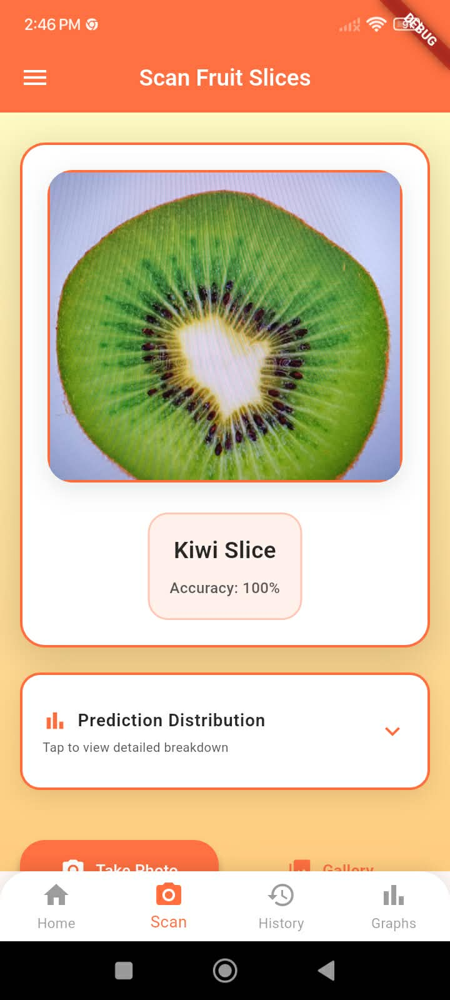 
<b>🥝 Kiwi Detected</b> 
Another detection example
</td>
<td align="center" width="33%">
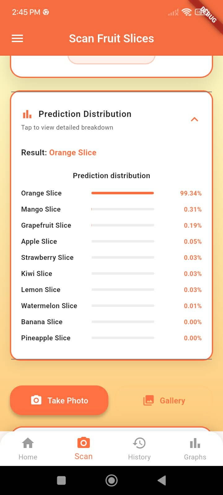 
<b>📊 Prediction Distribution</b> 
Expandable section showing probability breakdown for all 10 classes
</td>
</tr>
</table>

---

### History & Analytics

<table>
<tr>
<td align="center" width="50%">
 
<b>📜 Empty History</b> 
No scan history yet
</td>
<td align="center" width="50%">
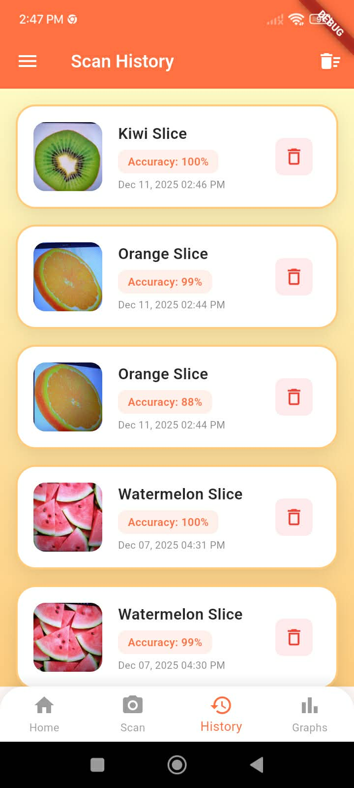 
<b>📜 Scan History</b> 
Log with thumbnails and labels
</td>
</tr>
<tr>
<td align="center" width="50%">
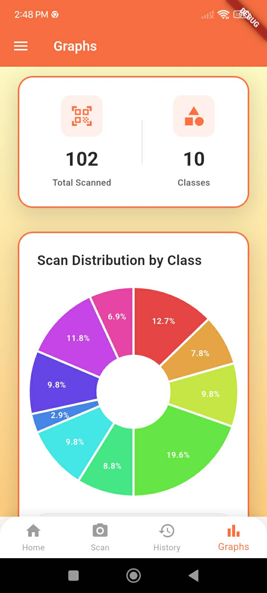 
<b>📊 Pie Chart</b> 
Visual distribution of scanned fruit types
</td>
<td align="center" width="50%">
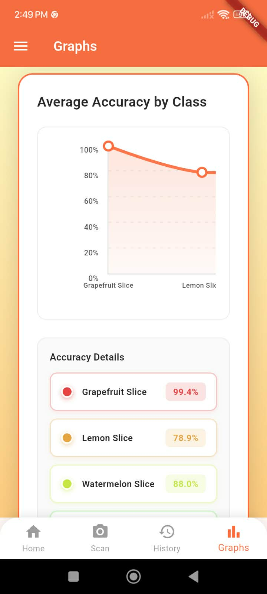 
<b>📈 Line Chart Analytics</b> 
Average detections per fruit class
</td>
</tr>
</table>

---
